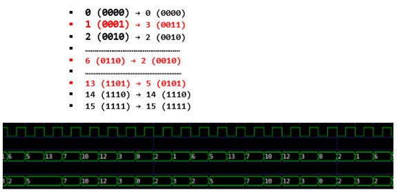

# Contador-Arbitrario 10-2-11-10-4-14-9-0-4-0 

## NOTA FINAL: 9.X

- Pablo Jesús González Rubio

## Enunciado

El objetivo de la práctica es diseñar e implementar en Verilog un contador arbitrario de 4 bits que genere una secuencia de números. 
 
A CADA GRUPO (PAREJA) SE LE ASIGNARÁ UNA SECUENCIA DISTINTA 
 
### EJEMPLO DE SECUENCIA:

`3 → 0 → 2 → 3  → 2  → 5  → 5  → 7 → 10  → 12`
 
 
### SE PIDE: 
 
Contador arbitrario que genere la secuencia asignada:

- Como se puede observar hay estados repetidos, se sugiere generar una secuencia alternativa dando a los estados repetidos el valor de algún estado que no aparezca, por ejemplo: 
 
  `3 → 0 → 2 → 1 → 6  → 5 → 13 → 7 → 10  → 12`
  
- Una vez generada esta secuencia diseñar un circuito combinacional que deshaga la transformación de estados (se recomienda emplear mapas de Karnaugh para la obtención del circuito): 
 
  
 
- Analizar el coste del circuito en término del número de puertas empleadas, y su minimización. 

### SE VALORARÁ: 
 
- El correcto funcionamiento del contador.
- El uso adecuado de los módulos y el diseño modular.
- El comentar debidamente el código.
- La originalidad del código e ideas propias.
- La minimización del circuito.

### SE DEBE ENTREGAR: 
 
- Código fuente: los módulos desarrollados y el módulo de pruebas.
- Se debe entregar una documentación en la que aparezca:
  - Objetivo y aspectos relevantes.
  - Desarrollo del contador arbitrario (grafo, mapas de Karnaugh, etc.)
  - Ejemplos de pruebas (Con y sin gtkwave)
  - Esquemas de los módulos desarrollados indicando las correspondencias de variables. 

### NOTAS: 
 
- La detección de copia, total o parcial, implica un cero automático en la parte práctica.
- Para que se evalúe esta práctica, al menos deberá compilar sin errores.
- Se podrá emplear el JK desarrollado con modelo de comportamiento como base del contador, pero el resto no podrá desarrollarse empleando esta técnica. 
